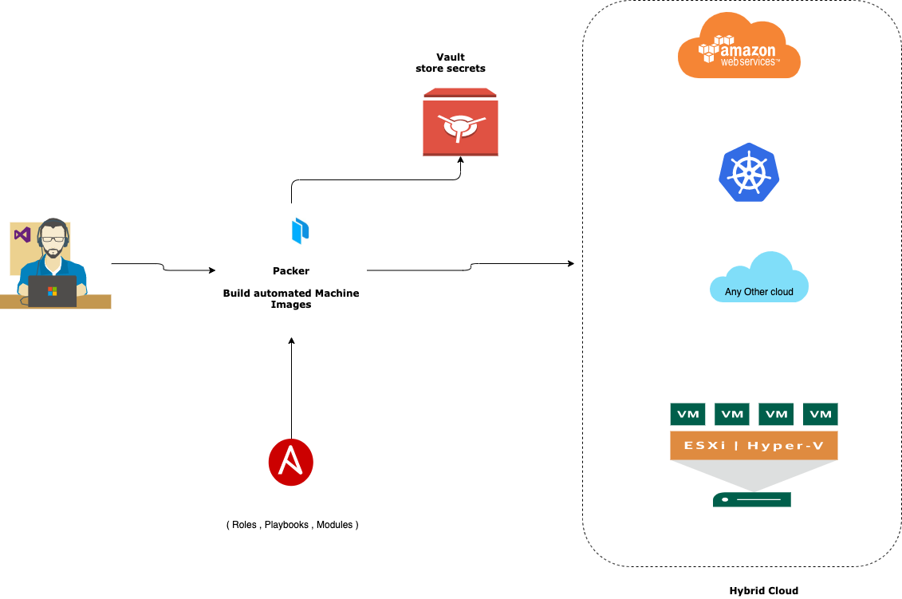
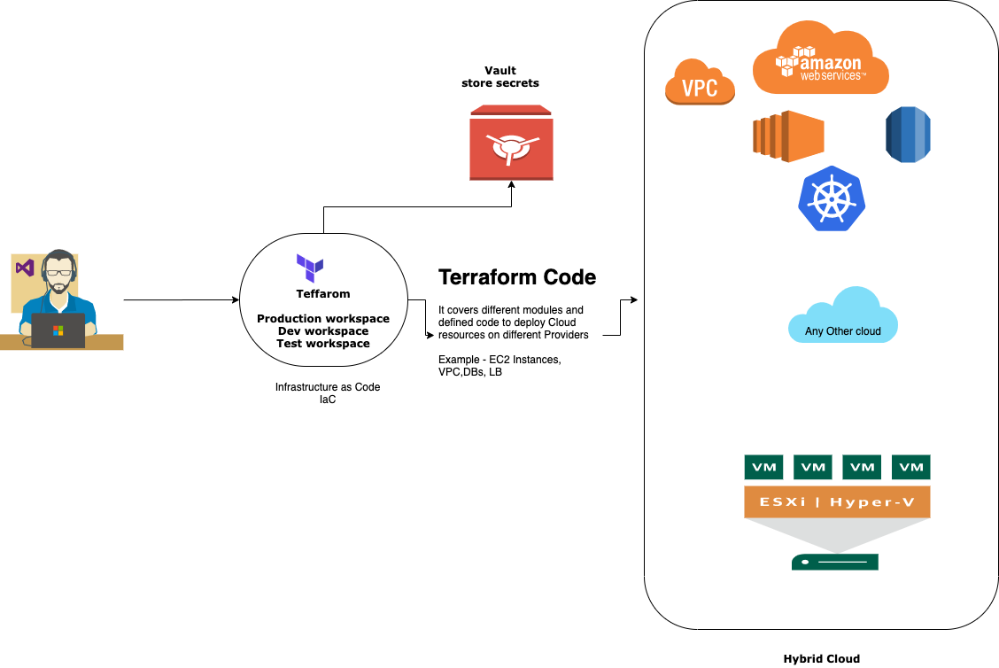

# BlockStack Validator Node Deployment

Multi Data Centre deployment

  - Packer - build AMI which covers all required tools for OS ( Base OS + Ansible Provisioner)
  - Terraform - Deploy EC2 instances, Security Group, VPC, LB ( Load Balancer)
  - AWS / OCI  - Cloud Providers
  - Blockchain Validator Node - blockstack 

### Tech

It uses below mentinoed open source tools

* [Packer](https://www.packer.io/) - Build Automated Machine Images
* [Terraform](https://www.terraform.io/) - Infrastructure as Code to provision and manage any cloud, infrastructure, or service
* [Blockstack](https://www.blockstack.org/) - Blockstack is an open-source and developer-friendly network for building decentralized apps and smart contracts.
* [AWS] (https://aws.amazon.com/) - Amazon Web Service - Cloud Computing Services
* [OCI](https://www.oracle.com/cloud/) - Oracle Cloud Infrastructure
* [LINUX](https://www.centos.org/) - Open Source Linux Operating System
* [CONTAINER](https://www.docker.com/) - Container software
* [SVC](https://github.com/) - Source code version control platform
* [ANSIBLE](https://www.ansible.com/) - Software provising and configuration management

### Setup

STEP-1 :



It requires account on AWS / OCI / Local DCs for multiple cloud deployment.

Once Account is ready on cloud provider end, let setup access key for local user to deploy complete stack.

* Packer Code example - https://github.com/singymingy/packer-20
* Ansible Code example - https://github.com/singymingy/ansible-c20/tree/master/roles

By using ansible provisioner in packer , let create AMI for AWS

IaC - Infrastucture as Code

It covers network , node deployments which docker ready stacks.

Let use terraform to deploy VPC ( Virtual Private Cloud ) and then deploy require no of EC2 instances by above created AMI in STEP-1.

* Terraform setup code - https://github.com/singymingy/tf-c20
* Terraform VPC deployment code - https://github.com/singymingy/tf-c20/tree/master/VPC
* Terraform EC2 instances deployment code - https://github.com/singymingy/tf-c20
 
Blockchain Node deployment:
```sh
cat app.sh
docker run -d \
  --name stacks_follower \
  --rm \
  -e RUST_BACKTRACE="full" \
  -e BLOCKSTACK_DEBUG="1" \
  -p 20443:20443 \
  -p 20444:20444 \
  blockstack/stacks-blockchain:latest \
/bin/stacks-node krypton
## deploy validator nodes 
$ ansible all -i aws_ec2.yaml -b  -u centos --key-file ~/.ssh/tf-aws.pem -a "sh app.sh"
## check nodes running as docker
$ ansible all -i aws_ec2.yaml -b  -u centos --key-file ~/.ssh/tf-aws.pem -a "docker ps"
## see logs  - It shows - INFO [1588108047.585] [src/chainstate/stacks/index/marf.rs:732] First-ever block 0f9188f13cb7b2c71f2a335e3a4fc328bf5beb436012afca590b1a11466e2206 
$ ansible all -i aws_ec2.yaml -b  -u centos --key-file ~/.ssh/tf-aws.pem -a "docker logs stacks_follower" ## see logs
```

Security Considerations:
*   Bare minimal OS installation
*   Only SSH allowed from own IP and only SSH-KEY Based authentication , Disable root remote login
*   Firewall inplace which only allow P2P port for validator nodes - in this CASE 20444 
