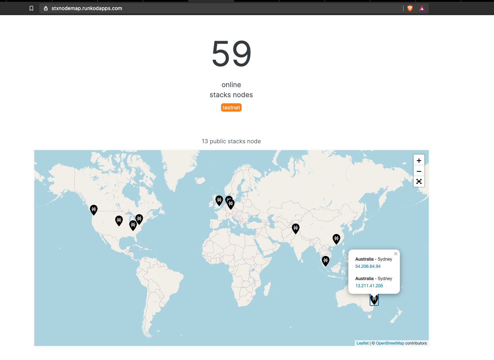

# BlockStack Validator Node Deployment

Multi AZ deployment

Basically, trying to deploy multiple validator nodes for Blockstack blockchain network by use of open source tools and technology...

### Tech

It uses below mentinoed open source tools and providers...

* [Packer](https://www.packer.io/) - Build Automated Machine Images
* [Terraform](https://www.terraform.io/) - Infrastructure as Code to provision and manage any cloud, infrastructure, or service
* [Blockstack](https://www.blockstack.org/) - Blockstack is an open-source and developer-friendly network for building decentralized apps and smart contracts.
* [AWS] (https://aws.amazon.com/) - Amazon Web Service - Cloud Computing Services
* [OCI](https://www.oracle.com/cloud/) - Oracle Cloud Infrastructure
* [LINUX](https://www.centos.org/) - Open Source Linux Operating System
* [CONTAINER](https://www.docker.com/) - Container software
* [SVC](https://github.com/) - Source code version control platform
* [ANSIBLE](https://www.ansible.com/) - Software provising and configuration management

### Setup

Base phase:

It requires account on AWS / OCI / Local DCs for multiple cloud deployment.

Once Account is ready on cloud provider end, let setup access key for local user to deploy complete stack.

* [Packer Code](https://github.com/singymingy/blockstak-c20/tree/main/packer) 

By using ansible provisioner in packer , let create AMI for AWS which covers centos 7 minimal OS + required Pkgs + DOCKER setup...

IaC - Infrastucture as Code

It covers network , node deployments which docker ready stacks.

Let use terraform to deploy VPC ( Virtual Private Cloud ) and then deploy require no of EC2 instances by above created AMI...

* [Terraform code](https://github.com/singymingy/blockstak-c20/tree/main/terraform)
* [VALIDATOR_NOEDES](https://github.com/singymingy/blockstak-c20/tree/main/terraform/vali-nodes)
* [VALIDATOR_NODES_WITH-LB](https://github.com/singymingy/blockstak-c20/tree/main/terraform/nodes-elb)
 

Security Considerations:
*   Bare minimal OS with root access is disabled. 
*   Only SSH allowed from own IP and only SSH-KEY Based authentication , Disable root remote login, and sudo access configured
*   Firewall inplace which only allow P2P port 20444 for validator nodes communication in decentralized blockchain networks and web API is enabled for internal operators only and it is behind load balancer from port 80 -> 20443

Post Deployment Verification:
without LB - validator node access and communication in network

without LB - validator node access and communication in network

LB-validator_node_API_CALL

nodes_on_map

